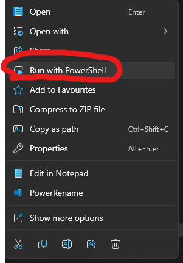

# Simcoe

## How to build

1. ensure you have the absolute latest version of vs2022
    * you need the *latest*, only the most recent release will work

2. right click `setup.ps1` and click `Run with PowerShell`

3. The install script may take several minutes to run, *do not close the console window*
    * You may be asked for permission to install packages such as python, accept them.
